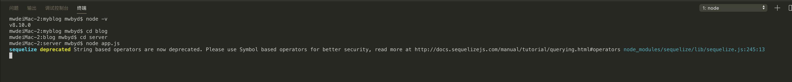
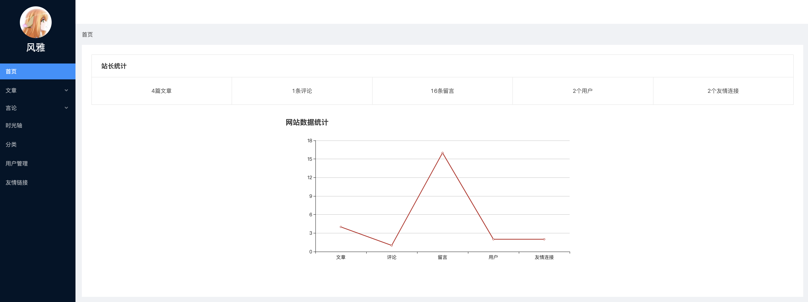
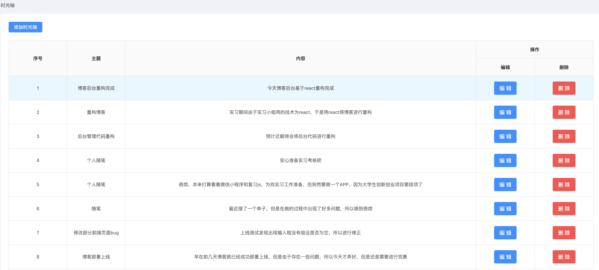
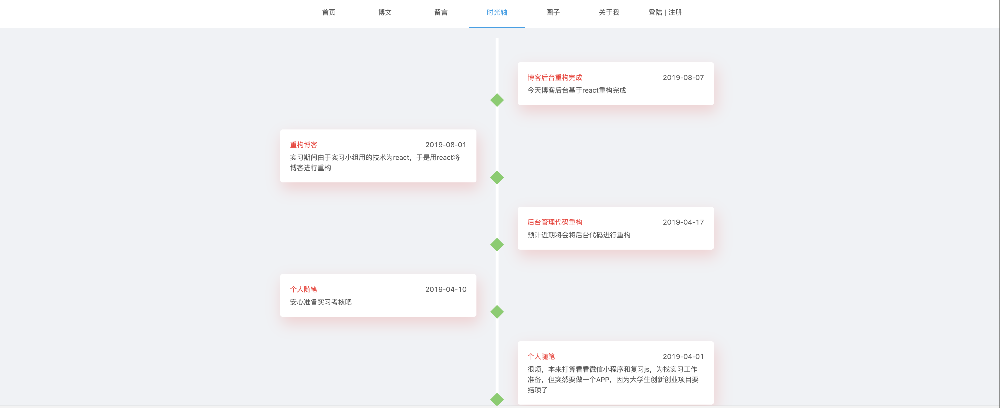

## 项目技术站

node >=8 ,  React  ant Design


## 项目说明

1. 该项目是博主自己的个人博客，禁止用做任何商业用途
2. 如有疑问可以联系本人`qq:1755033445`,请附加加友备注

### 文件夹说明

1. 项目后台管理系统——`admin文件夹`
2. 项目服务——`servse文件夹`
3. 项目前台界面文件夹——`view`

### 项目启动说明

#### 一、启动服务

1. 第一步：在`server`文件夹下创建一个新的文件`config/config.json`，内容如下

   ```json
   {
     "development": { // 不同环境下的数据库
       "username": "****", // 数据库名字（当前主机的数据库，一般默认为root）
       "password": "******", // 数据库密码
       "database": "****",  // 数据库的名字（所要链接的数据库）
       "host": "****", // 数据库所在主机地址
       "dialect": "mysql", // 数据库类型
       "timezone": "+08:00" // 时区
     },
     "test": {
       "username": "****", // 数据库名字（当前主机的数据库，一般默认为root）
       "password": "******", // 数据库密码
       "database": "****",  // 数据库的名字（所要链接的数据库）
       "host": "****", // 数据库所在主机地址
       "dialect": "mysql", // 数据库类型
       "timezone": "+08:00" // 时区
     },
     "production": {
       "username": "****", // 数据库名字（当前主机的数据库，一般默认为root）
       "password": "******", // 数据库密码
       "database": "****",  // 数据库的名字（所要链接的数据库）
       "host": "****", // 数据库所在主机地址
       "dialect": "mysql", // 数据库类型
       "timezone": "+08:00" // 时区
     }
   }
   
   ```

2. 第二步：下载相关依赖 `npm i`

3. 第三步：创建对应的数据库和表

    ```
    ./node_modules/.bin/sequleize db:create  // 创建数据库
    ./node_modules/.bin/sequleize db:migrate // 创建数据库表
    ```

4. 第四步：启动 `node app.js` 出现以下提示则表示链接成功
    

#### 二、启动后台管理

1. 第一步：进入 `admin` 文件夹
2. 第二步：

```javascript
npm i 
npm start
```

3. 部分界面展示
    后台管理首页

    后台管理时光轴

#### 三、启动前台界面

1. 第一步：进入 `view` 文件夹
2. 第二步：

```javascript
npm i 
npm start
```

3. 部分界面展示
    博客首页

    博客时光轴
